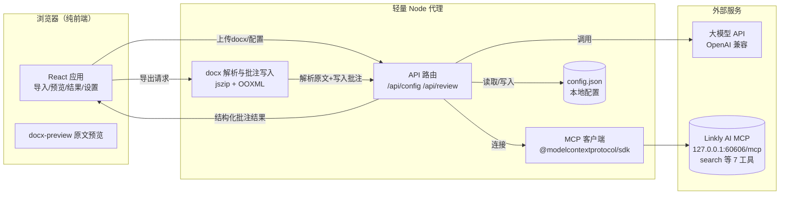

# DK QMS · GMP 文档审核助手 — 产品需求文档（PRD）

> 版本：v0.1（方案细化稿，待评审迭代）
> 日期：2026-07-21
> 状态：需求确认中，尚未进入编码

---

## 1. 项目概述

### 1.1 背景与目标
用户在日常 GMP（药品生产质量管理规范）质量管理工作中，需要频繁撰写并审查**偏差报告（Deviation Report）**、**风险评估报告（Risk Assessment）**等合规文档。这类文档的专业性强、引用标准多、易遗漏要点。

本项目旨在构建一款**网页应用**：导入一份 Word 报告后，调用 AI（大模型）结合 **Linkly AI 云端知识库**（含 GMP 技术标准与本地历史案例）对文档进行自动审阅，并将审阅意见以**原生 Word 批注（Comment）**的形式写回一份新的 Word 文档，供审核员在 Word/WPS 中继续处理。

### 1.2 范围（已确认）
- **形态**：网页应用 = 纯前端（静态站点）+ 轻量 Node 代理服务。
- **模型**：可配置多模型（OpenAI 兼容接口为主）。
- **批注**：生成**原生 Word 批注**（写入 docx `comments` 部件，Word/WPS 审阅窗格可见）。
- **知识库**：通过 Linkly AI MCP 接入（本机 `http://127.0.0.1:60606/mcp`），检索两个真实库 **`gmp`（GMP 标准/法规，1345 篇）** 与 **`sop`（技术文档/标准操作规程，3591 篇）**（无独立"本地案例"库）；已探明暴露 7 个工具（`search`/`read`/`grep`/`outline`/`explore`/`find_paths`/`list_libraries`），核心检索使用 `search`。
- **交付**：导出带原生批注的 `.docx`；**本地单机运行，无需登录**。
- **流程**：全自动审阅（上传即一键 AI 通读、定位问题、生成批注）。
- **批注结构**：多字段（问题摘要 + 严重程度 + 引用标准/条款 + 修改建议）。
- **风格**：专业清爽浅色主题（主色专业浅蓝 `#3B82F6`）。
- **文档模板**：不限定固定模板，审核对象可为任意类型/版式的 Word 文档，仅做内容审核，不调整原文档版式。
- **批注署名**：统一为 `DK QMS`。
- **切片策略**：默认不切片；设置中提供「是否切片 + 切片长度」开关，仅当文档过长时启用。
- **结果可编辑**：浏览器结果页允许用户手动新增 / 编辑 / 删除批注，确认后再导出。

### 1.3 不在本期范围
- 多人协同 / 账号体系 / 云端多租户。
- PDF 导出（已确认仅 docx）。
- 批注的"文内可视化嵌入"版本（已确认仅原生批注；浏览器内预览用自定义高亮+侧栏呈现，见 §4.3）。

---

## 2. 用户与场景

| 角色 | 描述 | 核心诉求 |
|------|------|----------|
| 质量审核员（主用户） | 撰写/审核偏差、风险评估报告 | 快速知道文档哪里不合规、缺什么、怎么改 |
| QA 主管 | 复核 AI 批注 | 在 Word 中看到结构化批注，可追溯依据 |
| 系统使用者 | 本机运行 | 简单配置即可用，模型 API 与 MCP 地址可填 |

**典型场景**：审核员导出一份偏差报告 `.docx` → 打开本应用 → 拖入文件 → 点击"开始审核" → 应用检索知识库并分析 → 浏览器展示带高亮的审阅结果 → 点击"导出 Word" → 得到一份含标准批注的新 `.docx`，直接在 Word 中打开即可见审阅意见。

---

## 3. 总体架构

### 3.1 架构图



### 3.2 关键设计决策（可调整）
1. **密钥与 MCP 连接放在代理端**：前端不直接持有模型 API Key / MCP Token，所有外部调用经 Node 代理转发，避免密钥泄露到浏览器。
2. **浏览器内预览 ≠ 原生批注渲染**：`docx-preview` 等库无法渲染 Word 原生批注。因此：
   - **浏览器内**：用"高亮锚定文本 + 右侧批注卡片"自定义呈现审阅结果。
   - **导出 docx**：在 OOXML 层写入真正的 `commentRangeStart/End` + `comments.xml`，Word/WPS 打开即见标准审阅批注。
3. **批注锚定**：AI 返回"锚定文本片段（anchorText）"，代理端在原文 `document.xml` 中匹配段落/位置，插入批注范围标记。

---

## 4. 功能模块详述

### 4.1 文档导入与预览
- **入口**：首页拖拽 / 点击选择 `.docx`（暂不支持 `.doc` 老格式，需先转换）。
- **解析**：代理端用 `jszip` 读取 `word/document.xml`，提取段落文本与结构（含表格），供送审与批注定位使用。
- **预览**：前端用 `docx-preview` 将原文渲染为网页可读视图（支持表格、基础样式）。
- **校验**：非 docx / 损坏文件给出明确错误提示。

### 4.2 AI 审核引擎（代理端 /api/review）
**流程**：
1. 接收文档全文（按段落切片，保留位置信息）。
2. **知识库检索（两阶段 + 自动筛选）**：
   - **自动筛选**：应用启动 / 打开设置时调用 `list_libraries` 自动枚举知识库，映射为 `gmp` / `sop` 两个范围开关，用户可在设置中单独开关（对应检索时的 `library` 参数）。
   - **提炼关键问题**：先让 LLM 通读文档，提炼出若干「审核关键问题」（如"偏差根因是否充分？CAPA 是否闭环？条款引用是否准确？"）。
   - **逐题检索**：对每个关键问题调用 `search`（混合 BM25 + 向量）检索相关知识库片段，必要时用 `library` 参数限定范围，各取 Top-K 汇总为审核依据。
3. **构造提示词**：将"原文 + 检索到的知识库片段 + 结构化输出要求"发送给大模型（OpenAI 兼容 `/v1/chat/completions`，启用 JSON 模式 / 结构化输出）。
4. **解析结果**：模型返回一组结构化批注（见 §6 数据模型）。
5. **进度反馈**：代理以 SSE / 流式接口向前端推送状态（"正在检索知识库…" / "正在分析第 N 段…" / "生成批注中…"）。

**提示词合约（要点）**：
- 角色：资深 GMP 合规审核专家。
- 任务：逐条审查文档，找出不合规、缺失、表述不当之处。
- 每条批注必须包含：`anchorText`（原文片段，便于定位）、`severity`（高/中/低）、`clause`（引用的标准/条款/文档，如"GMP 无菌药品附录 第12条"或"SOP WHM-SOP-00483"）、`summary`（问题摘要）、`suggestion`（修改建议）、`source`（依据来源库：gmp / sop / 两者）。
- 输出：严格 JSON 数组，不附加解释性文字。

### 4.3 审核结果展示与交互（前端）
- **双栏布局**：
  - 左：文档预览，命中批注的原文片段以**高亮**显示（按严重程度着色），点击高亮定位到对应批注。
  - 右：**批注卡片列表**，卡片含严重程度色标、引用条款、摘要、建议、依据来源。
- **交互**：
  - 支持按严重程度筛选、按来源（标准/案例）筛选。
  - 支持查看某条批注在原文的锚定位置。
  - **用户可手动新增 / 编辑 / 删除批注卡片**（如补充人工审核意见或修正 AI 误判），确认无误后再导出。
- **空结果**：若模型未发现问题，明确提示"未发现明显问题"。

### 4.4 批注写入与 Word 导出（代理端 /api/export）
- 输入：原始 docx（zip）+ 结构化批注数组。
- 处理（OOXML 方案）：
  1. 解压 docx，读取 `word/document.xml`。
  2. 对每个批注，依据 `anchorText` 定位目标段落/文本范围，插入 `<w:commentRangeStart w:id="n"/>` … 原文 … `<w:commentRangeEnd w:id="n"/>` 与 `<w:r><w:commentReference w:id="n"/></w:r>`。
  3. 新建 `word/comments.xml`，写入每条 `<w:comment w:id="n" w:author="DK QMS" w:date="…">`（含 severity/clause/summary/suggestion 文本）。
  4. 更新 `[Content_Types].xml` 与 `word/_rels/document.xml.rels` 注册 comments 部件。
  5. 重新打包为 `.docx` 返回。
- **导出**：前端触发下载（文件名带 `_审核批注` 后缀），同时可在浏览器内用 `docx-preview` 预览生成结果（批注以高亮+侧栏呈现，原生批注需 Word 打开查看）。

> 注：表格内文本、跨段落锚定属复杂情形，首版以"段落级锚定"为主，跨段/表内作为已知限制，后续增强。

### 4.5 设置中心（/settings）
本地持久化到 `config.json`（位于项目目录或用户目录，单机私有）。

| 配置项 | 说明 |
|--------|------|
| 模型 Provider | 下拉：OpenAI 兼容 / Claude / 本地 Ollama（可扩展） |
| API Base URL | 如 `https://api.linkly.ai/v1` |
| API Key | 密文存储（本地文件，仅本机可读） |
| 模型名称 | 如 `gpt-4o` / Linkly AI 模型 ID |
| MCP 地址 | 知识库 MCP 服务地址，默认 `http://127.0.0.1:60606/mcp` |
| MCP Token | 可选鉴权（本机桥接通常无需） |
| 知识库范围 | 默认同时启用 `gmp`、`sop` 两库，可单独开关（对应 `library` 参数） |
| 检索 Top-K | 默认 5，可调 |
| 切片开关 | 默认关闭；开启后按"切片长度"将长文档分块送审 |
| 切片长度 | 每块字符数（默认 4000，可调） |
| 严重度阈值 | 可选：仅导出≥中危（默认全部） |

---

## 5. 页面与交互设计

### 5.1 信息架构 / 路由
| 路由 | 页面 | 说明 |
|------|------|------|
| `/` | 导入页 | 拖拽上传、原文预览、开始审核 |
| `/review` | 审核中 | 进度状态展示 |
| `/result` | 结果页 | 双栏：高亮预览 + 批注卡片 |
| `/settings` | 设置中心 | 模型与 MCP 配置 |

### 5.2 视觉规范（专业清爽浅色）
**设计令牌（Design Tokens）**
| Token | 值 | 用途 |
|-------|-----|------|
| `--color-primary` | `#3B82F6` | 主操作、品牌（专业浅蓝） |
| `--color-bg` | `#F7F9FC` | 页面背景 |
| `--color-surface` | `#FFFFFF` | 卡片/面板 |
| `--color-text` | `#1F2937` | 正文 |
| `--color-text-2` | `#6B7280` | 次要文字 |
| `--color-border` | `#E5E9F0` | 描边/分割线 |
| 严重度·高 | `#E5484D`（红） | 高亮/色标 |
| 严重度·中 | `#F5862E`（橙） | 高亮/色标 |
| 严重度·低 | `#2C6EF2`（蓝） | 高亮/色标 |
| 圆角 | `8px` | 卡片/按钮 |
| 阴影 | `0 1px 3px rgba(16,24,40,.08)` | 轻量浮起 |

**字体**：`"PingFang SC", "Microsoft YaHei", system-ui, sans-serif`
**布局**：顶部应用栏（左 Logo"DK QMS 文档审核助手" + 右侧"设置"入口）+ 主内容区；结果页为左右双栏（约 6:4）。

**关键组件**
- 上传区：虚线边框拖拽区，hover 高亮主色。
- 按钮：主按钮实心主色；次按钮描边。
- 批注卡片：左色条（按严重度着色）+ 标题（条款）+ 摘要 + 建议 + 来源标签。
- 进度：步骤条 / 骨架屏，状态文案清晰。

> 主色已锁定为专业浅蓝 `#3B82F6`；如需更深/更浅可在主题令牌微调。

---

## 6. 数据模型与接口契约

### 6.1 批注结构（Comment）
```ts
interface Comment {
  id: string;            // 批注唯一 id（与 docx comment id 对应）
  anchorText: string;    // 锚定原文片段（用于定位与高亮）
  paragraphRef?: string; // 命中段落标识（代理端内部定位用）
  severity: 'high' | 'medium' | 'low';
  clause: string;       // 引用标准/条款/案例编号
  summary: string;       // 问题摘要
  suggestion: string;    // 修改建议
  source: 'gmp' | 'sop' | '两者';
}
```

### 6.2 审核结果（ReviewResult）
```ts
interface ReviewResult {
  docName: string;
  comments: Comment[];
  model: string;
  kbUsed: string[];      // 实际命中的知识库类型
  generatedAt: string;   // ISO 时间
}
```

### 6.3 接口（代理端，JSON / SSE）
- `GET /api/config` → 返回（脱敏）配置。
- `POST /api/config` → 保存配置。
- `POST /api/review` → 接收 `{ docBase64, options }`，**SSE 流式**返回进度事件，最终返回 `ReviewResult`。
- `POST /api/export` → 接收 `{ docBase64, comments }`，返回生成后的 `.docx`（文件流）。

---

## 7. 技术选型明细

| 层 | 技术 | 说明 |
|----|------|------|
| 前端框架 | Vite + React 18 + TypeScript | 纯静态，构建后由代理托管 |
| UI 组件 | Ant Design 5（light 主题，覆写令牌） | 企业级表单/表格/步骤条，开发快 |
| 状态管理 | Zustand | 轻量 |
| 原文/结果预览 | `docx-preview` | 浏览器内渲染 docx |
| 代理服务 | Node + Express（或 Fastify） | 提供静态资源 + API |
| MCP 客户端 | `@modelcontextprotocol/sdk` | 连接知识库 MCP |
| docx 处理 | `jszip` + 手写 OOXML 注入 | 解析与写入原生批注 |
| 模型调用 | `openai` npm（baseURL 覆盖）/ fetch | OpenAI 兼容 |
| 本地配置 | `config.json`（文件存储） | 密钥仅本机可读 |

> 备选：UI 也可用 Tailwind + shadcn 以获得更定制的清爽感；首版推荐 Ant Design 以提速。

---

## 8. 非功能性需求
- **安全**：API Key / MCP Token 仅存于本机 `config.json`，不进前端、不上传。
- **性能**：常规偏差报告（<50 页）审核在 1–3 分钟内完成；前端预览秒开。
- **兼容**：导出 docx 在 Word 2016+ 与 WPS 中可正常显示批注。
- **可观测**：代理端记录调用日志（可选开关），便于排查 MCP/模型异常。
- **可配置**：模型、MCP、Top-K、严重度阈值均可调，无需改代码。

---

## 9. 决策收敛记录（已确认）
- 不限定文档模板：审核对象可为任意 Word 文档，仅做内容审核，不调整版式。
- 浏览器结果可手动编辑（增/删/改批注）后再导出。
- 批注署名统一 `DK QMS`。
- 主色：专业浅蓝 `#3B82F6`。
- 切片：默认关闭；设置提供「切片开关 + 切片长度」。
- MCP：Linkly AI 本机服务 `http://127.0.0.1:60606/mcp`，已探明 7 个工具（核心检索 `search`）。

## 9.1 次要项收敛（已确认）
1. **知识库自动筛选**：应用启动 / 打开设置时自动调用 `list_libraries` 枚举知识库，映射为 `gmp` / `sop` 两个范围开关（无独立"本地案例"库），用户可在设置中开关。
2. **检索 query 策略**：采用「AI 提炼关键问题」方式——先由 LLM 通读文档提炼若干审核关键问题，再逐题调用 `search` 检索依据。
3. **样例文档已提供**（见 `样例文档/`）：`DEV-00460…偏差调查报告.docx`（偏差报告）、`QRW2026015…风险评估报告.docx`（风险评估）、`WHM-SOP-00483…标准操作规程.docx`（GMP 标准类，可作知识库对照），用于联调与提示词调优。

---

## 10. 里程碑建议（确认需求后）
1. **M1 脚手架**：Vite+React+AntD 前端壳 + Node 代理 + 配置读写。
2. **M2 导入预览**：docx 上传、`docx-preview` 渲染、代理端解析。
3. **M3 审核链路**：MCP 连接 + 模型调用 + 结构化批注 + 流式进度。
4. **M4 结果页**：高亮 + 批注卡片双栏交互。
5. **M5 导出**：OOXML 原生批注写入 + docx 下载/预览。
6. **M6 设置中心 + 联调 + 样例打磨**。

---

*本文件为需求基线，所有带"可调整/待确认"的条目将在后续评审中收敛，确认后进入编码。*
